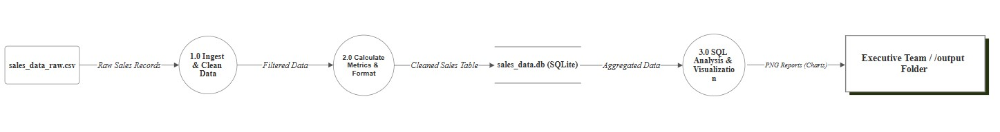
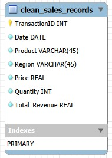
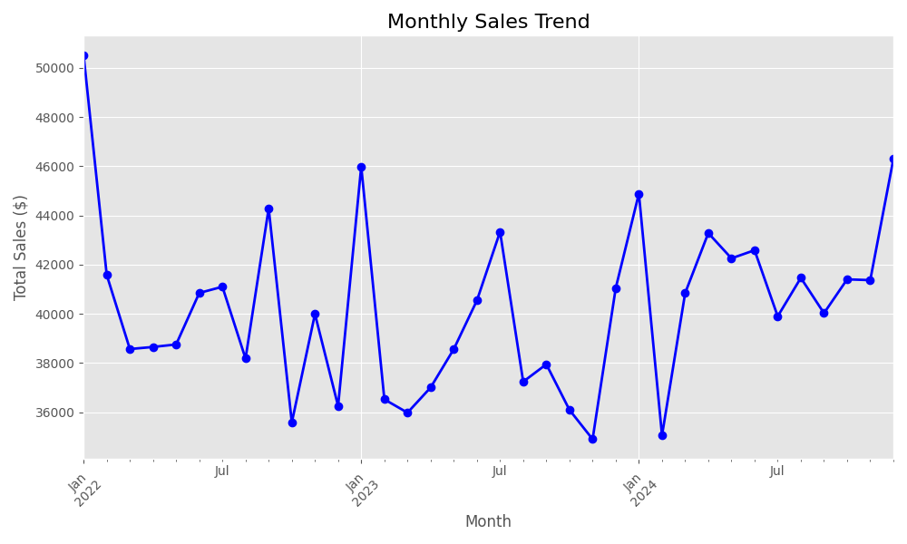

# Retail Sales Analysis Pipeline

**A full-stack data engineering pipeline that extracts raw sales data, cleans and transforms it using Python, loads it into a SQL database, and generates automated visualization reports.**

---

## Project Overview
This project simulates a real-world Data Engineering workflow. The goal was to take raw, messy retail sales data and convert it into actionable business insights for an executive team.

* **Role:** Data Engineer / Analyst
* **Goal:** Identify Q4 marketing trends from unstructured transaction records.
* **Data Source:** Public retail sales dataset (Source: Kaggle).

**Key Accomplishments:**
* **ETL Pipeline:** Built a robust extraction, transformation, and loading process.
* **Data Quality:** Implemented automated cleaning logic to handle missing values and correct data types.
* **Database Integration:** Designed a persistent SQLite database storage layer.
* **Automated Reporting:** Generated trend analysis charts using Matplotlib.

---

## Architecture & Design
The pipeline follows a standard **ETL (Extract, Transform, Load)** architecture, designed to ensure data integrity and reproducibility.

### Data Flow Diagram (DFD)

### Database Schema (ERD)

*See full documentation: [Project Specification](docs/project_spec.pdf) | [Implementation Roadmap](docs/ROADMAP.md)*

---

## Key Insights & Visualizations
After processing **11,000+ transaction records**, the analysis revealed the following trends:

### 1. Monthly Sales Trend
Sales have remained relatively steady throughout the fiscal year, with no significant seasonality detected.

### 2. Top Performing Products
"Beverages" and "Milk Products" are the highest volume drivers, suggesting a focus for Q4 inventory.

### 3. Sales Channel Distribution
Online sales ($749k) are slightly outperforming In-Store sales ($723k), indicating a need for continued digital marketing investment.

---

## Tech Stack
* **Language:** Python 3.11
* **Data Manipulation:** Pandas
* **Database:** SQLite / SQLAlchemy
* **Visualization:** Matplotlib
* **Version Control:** Git / GitHub

---

## How to Run This Project
*Note: These steps are for setting up the project on a new machine.*

**1. Clone the repository**

    git clone https://github.com/MykeT-Dev/Retail_Sales_Analysis.git
    cd Retail_Sales_Analysis

**2. Create a Virtual Environment**

    python -m venv venv
    source venv/bin/activate  # On Windows: venv\Scripts\activate

**3. Install Dependencies**

    pip install -r requirements.txt

**4. Run the Pipeline**

    python analysis_pipeline.py

**5. Check the Results**
* **Database:** `sales_data.db` (Use a SQLite viewer to inspect)
* **Charts:** Open the `output/` folder to see generated graphs.

---
**Author:** Myke Turza